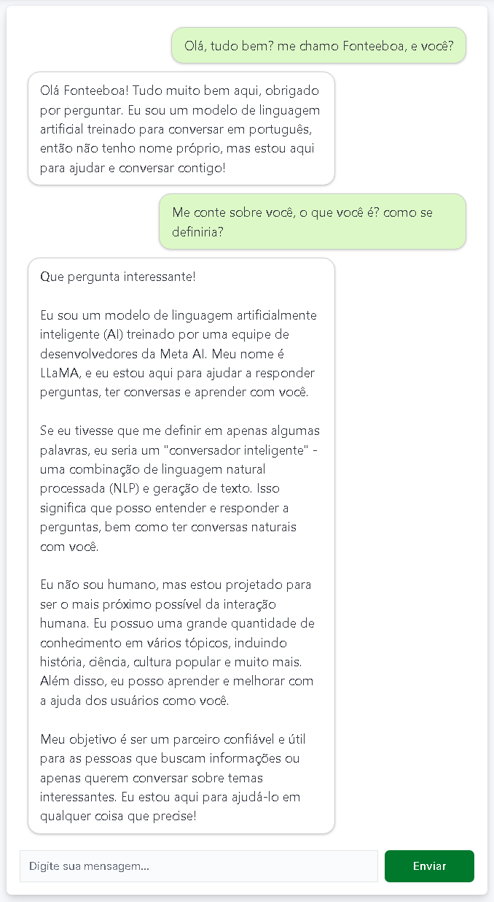

# 🧠 GPT4All Mark One 💡

For the English version of this README, click [here](README_EN.md).

Este projeto tem o intuito de aprender e utilizar o [GPT4All](https://www.nomic.ai/gpt4all), permitindo interações com um modelo de IA via API utilizando Flask e Docker.

## 📌 Pré-requisitos

- Docker instalado ([Instalação Docker](https://docs.docker.com/get-docker/))
- Python 3.11+ (caso queira rodar localmente sem Docker)

## 📂 Estrutura do Projeto

```plaintext
/app
├── script.py      # Código principal do servidor Flask
├── Dockerfile     # Configuração do container Docker
├── README_EN.md   # Este arquivo em ingles 😉
└── README.md      # Este arquivo 😉
```

## 🏗️ Construção e Execução do Container

### 🔨 Construindo a imagem Docker

```sh
docker build -t gpt4all-rpi .
```

### 🚀 Rodando o container

```sh
docker run --rm -p 5000:5000 -it gpt4all-rpi
```

## 📝 Uso da API

Após iniciar o container, a API estará disponível em:

```bash
http://localhost:5000/
```

### 🔹 Testando o endpoint raiz

```sh
curl http://localhost:5000/
```

**Resposta esperada:**

```plaintext
Server running with Llama-3.2-1B!
```

### 🔹 Enviando uma mensagem para o chatbot

```sh
curl -X POST http://localhost:5000/chat \
     -H "Content-Type: application/json" \
     -d '{"message": "Olá, como você está?"}'
```

**Resposta esperada:**

```json
{
  "response": "Olá! Como posso te ajudar hoje?"
}
```

## 🔍 Sobre o GPT4All

O projeto faz uso do [GPT4All](https://www.nomic.ai/gpt4all), um framework de modelos de IA de código aberto que permite interações locais sem depender de APIs externas. Para mais detalhes, acesse a [documentação oficial](https://docs.gpt4all.io).

## 🤖 Teste Prático do Chatbot em Execução no Servidor

📝 Observação: O chat abaixo foi desenvolvido em React para oferecer uma experiência de usuário (UI/UX) mais intuitiva e agradável, focando na usabilidade para o usuário final (futuramente o componente será disponibilizado na [FB-Library](https://github.com/fonteeboa/react-fb-library))


