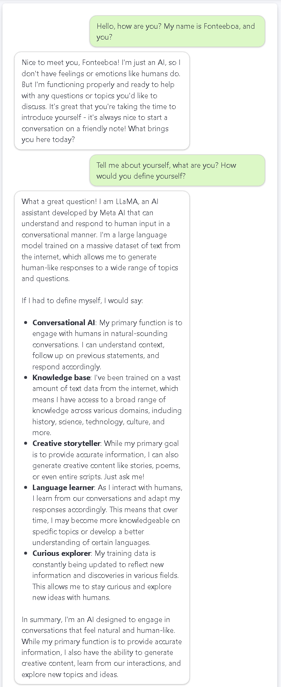

# 🧠 GPT4All Project with Flask and Docker 💡

Para a versão em português deste README, clique [aqui](README.md).

This project aims to learn and utilize [GPT4All](https://www.nomic.ai/gpt4all), enabling interactions with an AI model via API using Flask and Docker.

## 📌 Prerequisites

- Docker installed ([Docker Installation](https://docs.docker.com/get-docker/))
- Python 3.11+ (if you want to run it locally without Docker)

## 📂 Project Structure

```plaintext
/app
├── script.py      # Main Flask server code
├── Dockerfile     # Docker container configuration
└── README.md      # This file 😉
```

## 🏗️ Building and Running the Container

### 🔨 Building the Docker Image

```sh
docker build -t gpt4all-rpi .
```

### 🚀 Running the Container

```sh
docker run --rm -p 5000:5000 -it gpt4all-rpi
```

## 📝 API Usage

Once the container is running, the API will be available at:

```bash
http://localhost:5000/
```

### 🔹 Testing the Root Endpoint

```sh
curl http://localhost:5000/
```

**Expected Response:**

```plaintext
Server running with Llama-3.2-1B!
```

### 🔹 Sending a Message to the Chatbot

```sh
curl -X POST http://localhost:5000/chat \
     -H "Content-Type: application/json" \
     -d '{"message": "Hello, how are you?"}'
```

**Expected Response:**

```json
{
  "response": "Hello! How can I help you today?"
}
```

## 🔍 About GPT4All

This project uses [GPT4All](https://www.nomic.ai/gpt4all), an open-source AI model framework that enables local interactions without relying on external APIs. For more details, check out the [official documentation](https://docs.gpt4all.io).

## 🤖 Practical Chatbot Test Running on the Server

📝 Note: The chat interface below was developed in React to provide a more intuitive and user-friendly UI/UX experience, focusing on usability for end users. (In the future, the component will be available in the [FB-Library](https://github.com/fonteeboa/react-fb-library))


